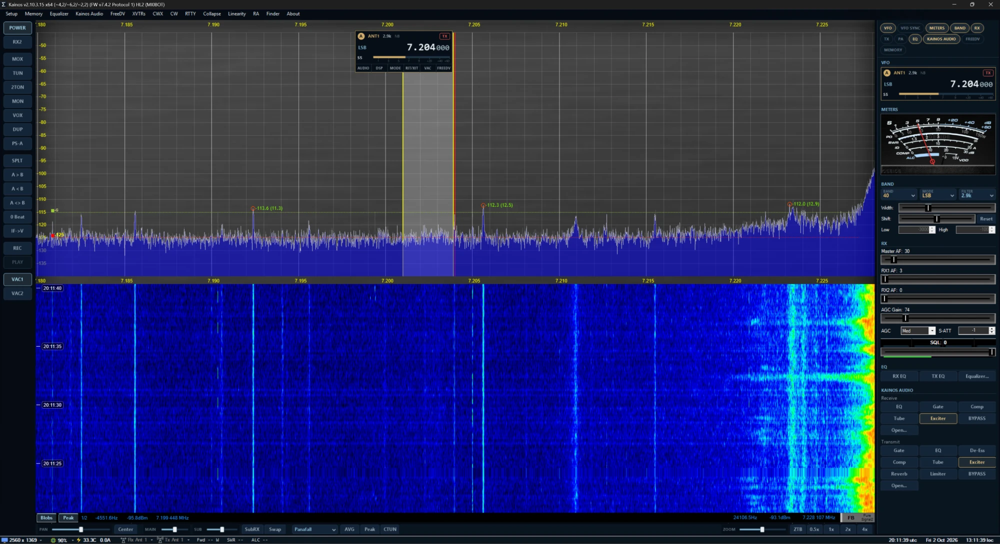

# Kainos

Kainos is a Software Defined Radio (SDR) application for Windows, maintained by Justin Cron, K7JUS.

Kainos is a fork of [Thetis](https://github.com/ramdor/Thetis), and builds on the Hermes Lite 2 edition of Thetis by Reid Campbell, MI0BOT ([OpenHPSDR-Thetis](https://github.com/mi0bot/OpenHPSDR-Thetis)). Nearly everything Kainos can do comes from the many years of work by the Thetis and OpenHPSDR community. See [Credits](#credits) below.

- Releases: https://github.com/PNWHam-K7JUS/Kainos/releases
- Current version: 1.0.6 (based on Thetis 2.10.3.15)

## What Kainos adds

- **A modern layout**: a dark, tidy console in the Kainos colours, switchable back to the Thetis (Classic) look in Setup > Appearance > Kainos, with its own UI scale (75-200%).
  - **Slice flags** on the panadapter (SmartSDR style) for VFO A and, with RX2 or split on, VFO B: antenna, filter, active DSP, mode, frequency and an S meter. Turn the mouse wheel over a digit to tune by that digit, click the frequency to type one, and click TX to choose the transmit VFO. Flags are see-through until the mouse is over them, and can be dragged down the panadapter by their face so spots along the top stay visible. Tabs under the flag open its audio, DSP, mode, RIT/XIT, VAC and FreeDV controls.
  - **A right-hand column of tabs** you turn on and off: VFO, VFO sync, meters (an analog meter; OE3IDE's FTDX-5000 skin is offered on first run), band / mode / filter, RX, TX, PA profile, EQ, Kainos Audio, FreeDV and memories.
  - **A Kainos panadapter background**: dark navy with the logo faint behind the trace (Setup > Appearance > Kainos).
  - **3D stacked-trace panadapter (experimental)**: the **3D** button under the panadapter stacks the last few seconds of traces behind the live one, in the waterfall's colours. It is new, uses more CPU, and may change.
  - **Every window in the Kainos look**: Setup, Memory, Equalizer and the rest open dark, like the Kainos Audio window; sliders and menus look the same on every PC.
  - **A left-hand column** with power, transmit, VFO and VAC buttons, and **a bar under the panadapter** for pan, zoom, display mode and multi-RX. Everything else at the bottom of the window is gone, so the panadapter and waterfall use the full height.
- **RTTY**: built-in RTTY (45.45 baud, 170 Hz shift and others) with no extra programs or virtual audio cables. Open **RTTY** in the menu bar: the terminal opens under the panadapter (or in its own window) with received text, type-ahead sending, macros and a tuning indicator. Use DIGL or LSB.
- **CW**: a built-in CW decoder and sender. Open **CW** in the menu bar: the terminal (laid out like RTTY's) decodes the receiver at your CW pitch and follows the sender's speed, and what you type or send from the macros goes out through Thetis's CWX keyer at your chosen speed. Use CWL or CWU and zero-beat the signal.
- **Built-in spotting**: DX cluster and POTA spots on the panadapter (callsign tags with flags; click to tune) and in a SPOTS tab, with no other program. It logs in to the cluster with your callsign automatically (the one in Setup > DSP > FreeDV (RADE)).
- **KiwiSDR**: the KIWI tab lists the nearest public KiwiSDRs; click one to listen, following VFO A or tuned on its own, with favourites, search and a choice of output device.
- **Kainos Audio**: audio processing for the voices you hear and your own transmitted voice, in one window with Receive and Transmit tabs. Open it from **Kainos Audio** in the menu bar. The processing is ported from [AetherSDR](https://github.com/aethersdr/AetherSDR):
  - **Receive**, on every receiver: parametric EQ, gate, compressor, tube saturation and the AetherVoice exciter. Saved with your settings.
  - **Transmit**: gate, parametric EQ, de-esser, compressor, tube saturation, AetherVoice, reverb and a final limiter. Saved in each TX profile.
  - **AetherVoice** adds low-end body and high-end clarity to voice. It can also be switched on with the **AV** button on the console (right-click it for a small AetherVoice window) or set in Setup > DSP > AetherVoice.
  - Everything works in voice modes only and is bypassed automatically in CW and digital modes, so decoders are never affected. On transmit, test into a dummy load and check your signal on a second receiver before using it on the air.
- **FreeDV RADE**: built-in [FreeDV](https://freedv.org) RADE digital voice (the Radio Autoencoder, V1 and V2) on RX1, RX2 and the transmitter, ported from [Thetis-RADE](https://github.com/sv1eia/Thetis-RADE) by Christos Nikolaou, SV1EIA. Open **FreeDV** in the menu bar, pick **RX1** or **RX2** and press **RADE**: the receiver changes to DIGU or DIGL, received RADE is decoded straight to speech, and your overs are sent as RADE with your callsign in the end-of-over frame (a VFO B over with RX2 on uses RX2's RADE). The TX compressor, CFC and EQ are bypassed during RADE overs. No separate FreeDV program or virtual audio cables are needed. The window shows sync, SNR, frequency offset, levels and the last callsign heard; settings (callsign, levels, mic noise reduction, AGC and EQ) are in Setup > DSP > FreeDV (RADE).
  - **On the panadapter and in meters**: while a receiver has RADE on, its panadapter shows sync, SNR, level, clip and the last callsign at the top right (the mic level and clip while transmitting); RADE readings and the last callsign can also be added to meter containers (Setup > Appearance > Meters/Gadgets), and a container can hide itself while its receiver has no RADE.
  - **FreeDV Reporter**: the **Reporter** button in the FreeDV window shows who is on RADE right now ([qso.freedv.org](https://qso.freedv.org)), filtered by band or following your frequency; double-click a station to tune to it. Tick "Report my station" in Setup > DSP > FreeDV (RADE) (with your callsign and grid square) to appear on it yourself while RADE is on, as FreeDV-GUI does. Nothing about you is sent unless that box is ticked.

## Kainos and Thetis side by side

Kainos is installed and run separately from Thetis, so both can be on the same PC:

- The program is `Kainos.exe`, installed to `Program Files\OpenHPSDR\Kainos-HL2`
- Settings are kept in `%APPDATA%\OpenHPSDR\Kainos-x64` and the registry key `HKCU\Software\OpenHPSDR\Kainos-x64`
- Recordings are saved to `Music\Kainos`
- The Kainos installer will not upgrade or remove an existing Thetis install

The first time Kainos starts, if it finds an existing Thetis install, it offers once to copy your Thetis settings (databases, meters, skins and cmASIO settings) into Kainos. Your Thetis settings are not changed. A Thetis database can also be imported later from the Database Manager.

Kainos still identifies itself as Thetis to TCI and TCP CAT clients, so logging and contest software that supports Thetis keeps working. Thetis meter skins work in Kainos too.

## Building

1. Once, after cloning: run `Project Files/lib/build_rade_libs.bat` (and `build_rade_libs.bat Debug` if you build Debug). It builds the static libraries RADE needs (opus, RADE, RNNoise, libebur128 and the WebRTC AGC) with Visual Studio 2026 and CMake.
2. Open `Project Files/Source/Thetis_VS2026.sln` in Visual Studio 2026, select the `Release | x64` configuration and build. The program is built to `Project Files/bin/x64/Release/Kainos.exe`.

## Credits

Kainos would not exist without the people who built Thetis and the software it grew from. With thanks to:

- Doug Wigley, W5WC: Thetis, ChannelMaster, UI and much more
- Richard Samphire, MW0LGE: Thetis UI, meters and much more
- Reid Campbell, MI0BOT: Thetis for the Hermes Lite 2
- Warren Pratt, NR0V: WDSP, the DSP engine at the heart of Thetis, and many other contributions
- Laurence Barker, G8NJJ: G2, Andromeda and protocols
- Phil, VK6PH; Bill Tracey, KD5TFD; Rick, N1GP; Bryan, W4WMT; Chris, W2PA; Joe, K5SO; and the many other contributors listed in the About window
- FlexRadio Systems: PowerSDR, from which Thetis was originally derived
- The AetherSDR contributors: the AetherVoice exciter
- Christos Nikolaou, SV1EIA: Thetis-RADE, the FreeDV RADE integration that Kainos's FreeDV support is ported from
- David Rowe, VK5DGR, Jean-Marc Valin, Mooneer Salem, K6AQ, and the FreeDV project: RADE, FreeDV and codec2; Peter B Marks: radae_nopy, the reference for the C port of RADE
- Xiph.Org and the Opus contributors (Opus, LPCNet/FARGAN), Jean-Marc Valin (RNNoise), Aleksey Vaneev (r8brain), Jan Kokemüller (libebur128) and the WebRTC project authors (AGC)
- The OpenHPSDR and Apache Labs communities, the skin authors, and all the testers

The Thetis manuals and guides that ship with Kainos are the original Thetis documents and remain the work of their authors.

## License

Kainos is free software, distributed as a whole under the GNU General Public License version 3 or later. See [LICENSE-GPL-3.0](LICENSE-GPL-3.0).

Kainos combines code under two compatible licenses. Thetis and WDSP are licensed under the GNU GPL version 2 "or (at your option) any later version" (see [LICENSE](LICENSE)), and each of their files keeps that notice. The AetherVoice code, derived from AetherSDR, is licensed under the GNU GPL version 3 or later. The RADE integration from Thetis-RADE is GPL version 2 or later. The libraries under `Project Files/lib` used for RADE keep their own licenses, all compatible with the GPL: RADE (radae_c) BSD-2-Clause, Opus and RNNoise BSD-3-Clause, r8brain and libebur128 MIT, the WebRTC AGC BSD-3-Clause, FreeDV-GUI's rade_text BSD-2-Clause and the codec2 files LGPL-2.1; each library folder has its license file. Like Thetis, Kainos also includes code under the dual-licensing statement in [LICENSE-DUAL-LICENSING](LICENSE-DUAL-LICENSING), which applies only to code written by Richard Samphire, MW0LGE.

## Upstream release history

Changes from the Thetis Hermes Lite 2 edition that Kainos is based on:

### 2.10.3.15 (2026-09-04)

- Upgraded to release 2.10.3.15 of official Thetis
- Corrected timeout of auto tune routine
- Updated alternate RX selection form
